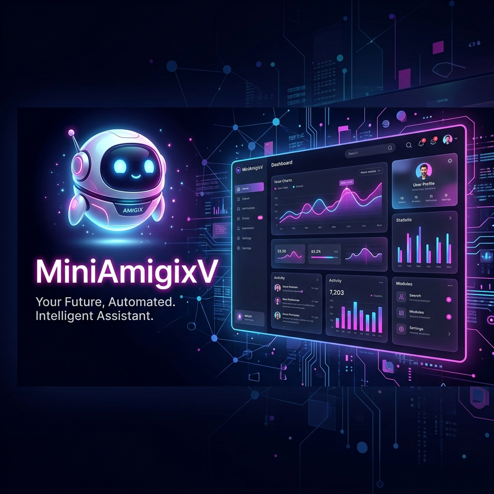

<div align="center">

# 💖 MiniAmigixV: High-Performance Zen Edition

### 🌟 Centro de mando personal diseñado con Django + IA + Focus Zone Premium



<br>


</div>

---

# ✨ Descripción

**MiniAmigixV** ha evolucionado de un dashboard minimalista a una **Suite de Alto Rendimiento y Bienestar**. Combinando el poder de **Django** con interacciones de **IA y Productividad Avanzada**, ofrece un entorno diseñado para el enfoque profundo, la organización y la relajación.

Desde conquistar tus exámenes en la **Focus Zone** hasta sumergirte en una sesión de relajación en la **Zen Zone**, MiniAmigixV es tu compañero digital de élite.

---

# 🚀 Características de Vanguardia

### 🎓 Focus Zone (Zona de Enfoque) - **NUEVO**
Diseñada para el máximo rendimiento académico y profesional:
*   **Temporizador Pomodoro**: Reloj circular con anillo de progreso neon y alertas de sonido.
*   **Flashcards 3D**: Repaso interactivo con animaciones de giro tridimensional.
*   **Session Goals**: Gestor de objetivos inmediatos para mantener el flujo de trabajo.

### 🧘 Zen Zone (Anti-Estrés)
Experiencias interactivas diseñadas para reducir la ansiedad:
*   **Pop It / Neon Snake / Memory Matrix**: Juegos minimalistas diseñados para el relax.
*   **Caja Mágica**: Cuadro interactivo con explosiones de partículas y sonidos binaurales.
*   **Respiración Guiada**: Ciclos rítmicos para meditación profunda.

### 🎬 Mi Bóveda de Contenido (Entretenimiento) - **NUEVO**
*   **Gestor Personal de Medios**: Guarda tus videos, tutoriales, tableros de Pinterest y artículos para leer o ver después.
*   **Interfaz Dinámica**: Interfaz organizada y premium con filtros para tu contenido favorito.

### 📅 Smart Event Manager
*   **FullCalendar Integration**: Gestión visual de eventos y citas.
*   **Quick Widgets**: Acceso rápido a eventos próximos desde el encabezado del inicio.

### 💾 Infinite Memory (Persistencia Total)
*   **LocalStorage Integration**: Tu música, tus eventos, enlaces de entretenimiento y tu ciudad favorita se quedan guardados en tu computadora. ¡Nunca más pierdas tu configuración al refrescar!

### 🎙️ Inteligencia Vocal & Clima
*   **Voz IA Automática**: MiniAmigixV te guía por cada sección con síntesis de voz proactiva.
*   **Sky Cast**: Datos meteorológicos en tiempo real con consejos de IA para tu día.

---

# 🛠 Stack Tecnológico

| Tecnología | Uso |
|-----------|------|
| **Python / Django** | Corazón del Backend y arquitectura SPA |
| **JavaScript (ES6+)** | Lógica de Pomodoro, Flashcards, Feed y Persistencia |
| **FullCalendar API** | Motor de gestión de eventos |
| **LocalStorage API** | Almacenamiento persistente del lado del cliente |
| **Canvas & Web Audio** | Motores de juegos Zen y feedback acústico |
| **CSS3 (Glassmorphism)** | Interfaz premium con desenfoque de cristal y neón |

---

# 📷 Galería del Proyecto

## 🎓 Focus Zone (Modo Estudio)


## 🧘 Zen Zone & Games


## 🌦️ Sky Cast Station


---

# ⚙ Instalación y Despliegue

```bash
# Clonar el proyecto
git clone https://github.com/maria45889/miniamigixv.git

# Entrar al directorio
cd miniamigixv

# Instalar dependencias
pip install -r requirements.txt

# Preparar base de datos
python manage.py migrate

# ¡Encender el Dashboard!
python manage.py runserver
```

---

<div align="center">
Desarrollado con ❤️ para Majo por el equipo de MiniAmigixV
</div>